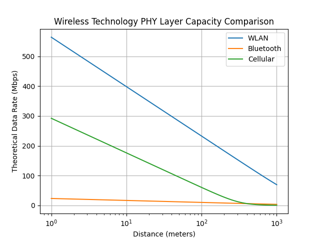

# Documentation

## Plot

## Questions
1. WLAN has the highest rate at closest range as that's what it's optimized for. It's meant to excel at that, as shown by its relatively high bandwidth and power.
2. Bluetooth has the lowest rate and shortest also due to the fact that that's just what its meant for. It's not meant to transmit large amounts of data over large areas, it's mean for short, low power communications. This is shown by its low power and low bandwidth.
3. Cellular outperforms WLAN at medium to long difference as it is way higher power, so it propagates farther. This is not really visible in our graph as the distance limit is 1000m and we use a default noise floor of 95db, but would be visible over larger distances or with different values. WLAN's power limitations means it struggles over long distances.